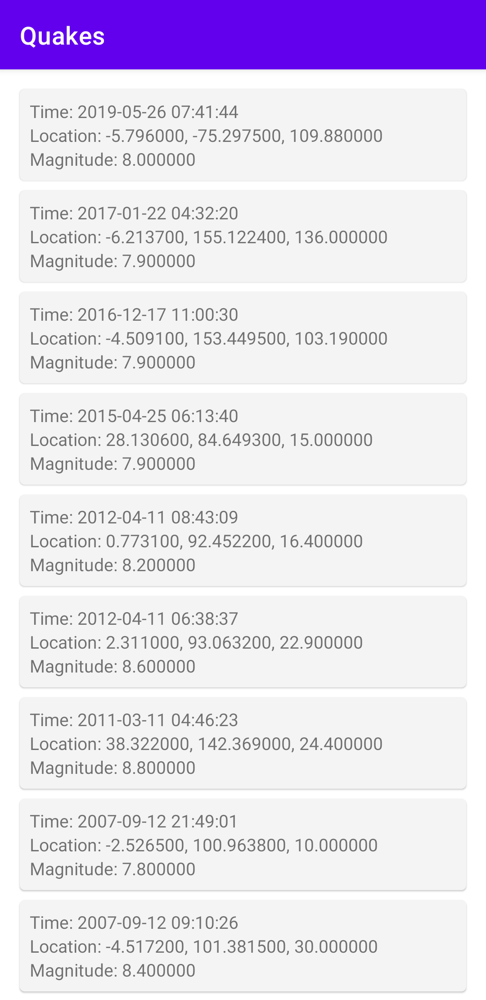
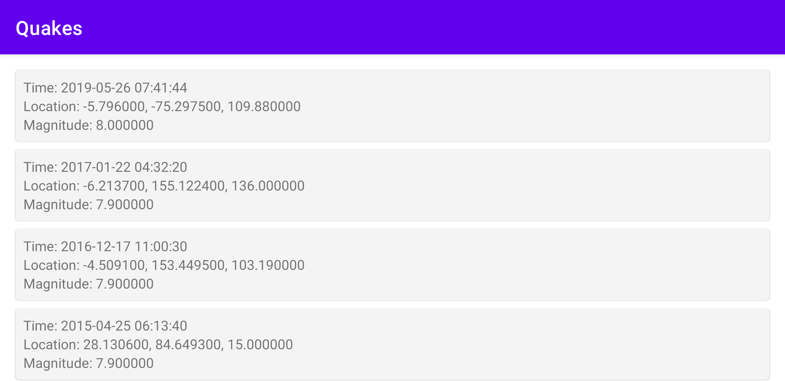
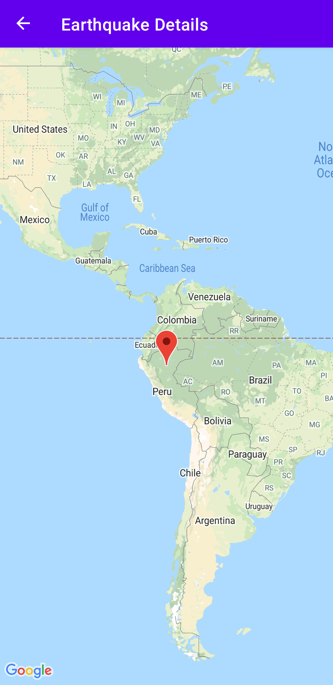

# Movies Compose
A simple application that retrieves a list of earthquakes and allow the user to see where they occured
in the world. Using Clean Architecture with MVI on the presentation layer.

## Running
Add the following to your local gradle properties (~/.gradle/gradle.properties)
```
earthquakes.googlemaps.apikey=[GOOGLE API KEY]
earthquakes.geonames.username=[GEONAMES USERNAME]
```

## Screenshots
#### Portrait


#### Landscape


#### Detail


## Languages, Libraries & Tools
* [Kotlin w/ Coroutines](https://kotlinlang.org/)
* [Android Architecture Components - ViewModel](https://developer.android.com/topic/libraries/architecture/viewmodel.html)
* [Android Architecture Components - Navigation](https://developer.android.com/guide/navigation)
* [Android Architecture Components - LiveData](https://developer.android.com/topic/libraries/architecture/livedata)
* [Retrofit](https://square.github.io/retrofit/)
* [Moshi](https://github.com/square/moshi)
* [Dagger 2 w/ Hilt](http://google.github.io/dagger/)
* [Google Maps](https://developers.google.com/maps/documentation/android-sdk/start)
* [Mockk](https://github.com/mockk/mockk)
* [Assertk](https://github.com/willowtreeapps/assertk)
* [Okhttp - mockwebserver](https://github.com/square/okhttp/tree/master/mockwebserver)
* [Ktlint Gradle](https://github.com/JLLeitschuh/ktlint-gradle)

## License
```
Copyright 2021 Robert Eggar.

Licensed under the Apache License, Version 2.0 (the "License");
you may not use this file except in compliance with the License.
You may obtain a copy of the License at

    http://www.apache.org/licenses/LICENSE-2.0

Unless required by applicable law or agreed to in writing, software
distributed under the License is distributed on an "AS IS" BASIS,
WITHOUT WARRANTIES OR CONDITIONS OF ANY KIND, either express or implied.
See the License for the specific language governing permissions and
limitations under the License.
```